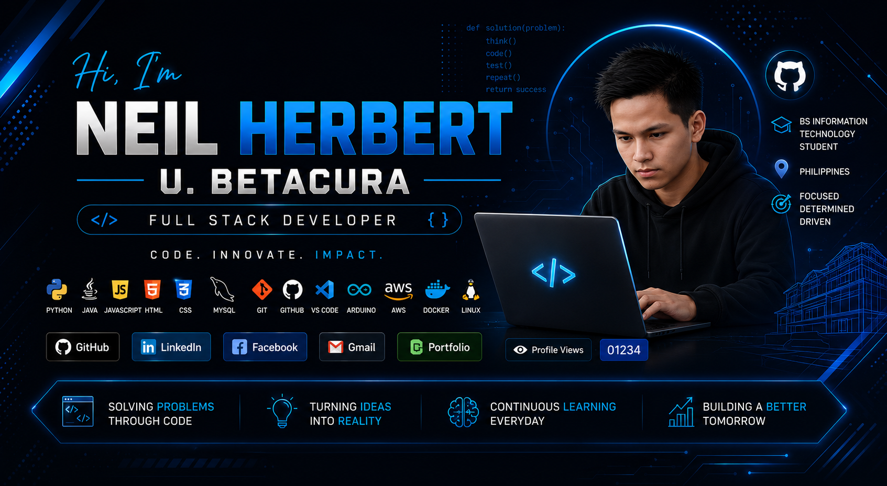

    

<h1 align="center">
Hi 👋 I'm Neil Herbert U. Betacura
</h1>

<h3 align="center">
BS Information Technology Student
</h3>

<h2>💻 Tech Stack</h2>

  

## 🚀 About Me

- 🎓 4th Year BS Information Technology Student
- 💻 Full Stack Developer
- 🤖 Arduino & IoT Enthusiast
- 🌐 Web Application Developer
- 📚 Currently Learning Cloud Computing & Cybersecurity
- 🚀 Building PharmaVend Smart Medicine Vending Machine

